# 반창고 — 유저플로우

> 중·고등학교 담임교사와 학생을 위한 AI 기반 통합 학급관리 웹앱
> 문서 버전 v1.1 · 작성일 2026-08-28 · 최종 수정 2026-08-29 (→ 문서 끝 「변경 이력」 참고)
> 작성 기준: Manyfast 유저플로우 v1 (섹션 6개, 노드 129개, 엣지 187개)의 섹션 구조 + 기능명세서의 트리거·동작·예외 정의
> 관련 문서: `반창고_기획서.md`(PRD), `반창고_기능명세서.md`(기능 상세, 관련 기능 ID 참조)

이 문서는 Manyfast에 작성된 유저플로우 다이어그램과 동일한 6개 섹션 체계로 서비스의 화면 흐름을 정의한다.
각 플로우는 단계 목록과 mermaid 다이어그램으로 표현하며, 관련 기능 ID(`F-`)로 기능명세서와 연결된다.

## 섹션 구성

| 섹션 | 이름 | 주요 역할 | 관련 기능 |
|---|---|---|---|
| S1 | 인증·진입 | 전체 | F-UBHBGS, F-ZYSPUS |
| S2 | 학생 학급 정보 조회 | 학생 | F-ZTJSNU, F-WSHIYO, F-NXPULH, F-ZYSPUS |
| S3 | 교사 학급 운영 관리 | 담임교사 | F-RONORQ, F-FMLMIG, F-WSHIYO, F-WFEXUJ, F-OHHQTM, F-ZOJYKF |
| S4 | 알림·계정·설정 | 학생, 담임교사 | F-IAXPMY, F-ETJOMB |
| S5 | AI 챗봇 | 학생 | F-CCZIQT |
| S6 | 서비스 관리자 | 서비스 관리자 | F-UBHBGS, F-ETJOMB |

## 전역 탐색 구조 (F-ZYSPUS)

로그인 후 모든 주요 화면에서 하단 탭바(`홈 → 우리반 → 할일 → 더보기`)로 이동한다.
원본 상세 화면·작성/수정 화면에서는 탭바를 표시하지 않는다.

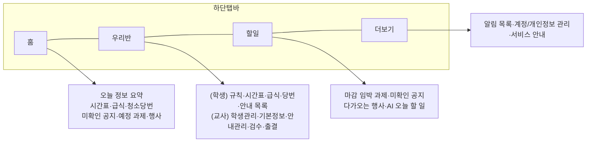

---

## S1. 인증·진입

관련 기능: F-UBHBGS(로그인·접근 제어), F-ZYSPUS(전역 탐색)

### S1-1. 이메일 로그인과 역할별 진입

1. 사용자가 로그인 화면에서 이메일 로그인 정보를 제출한다.
2. 시스템이 인증하고 역할, 계정 상태, 학급 소속을 확인한다.
3. (예외) 인증 실패 → 로그인 미완료, 오류 안내 후 로그인 화면 유지.
4. (예외) 비활성화·탈퇴 계정 → 로그인 차단.
5. 역할별 분기:
   - 학생: 소속 학급 있음 → 홈(오늘의 학급 정보 대시보드) / 소속 없음 → 학급 참여 대기 안내.
   - 담임교사: 승인 + 학급 있음 → 홈 / 승인 + 학급 없음 → 학급 생성 화면 / 미승인 → 승인 대기 안내(학급 생성·운영 불가).
   - 서비스 관리자: 관리자 화면.
6. 로그인 성공·접근 거부 이벤트를 기록한다.

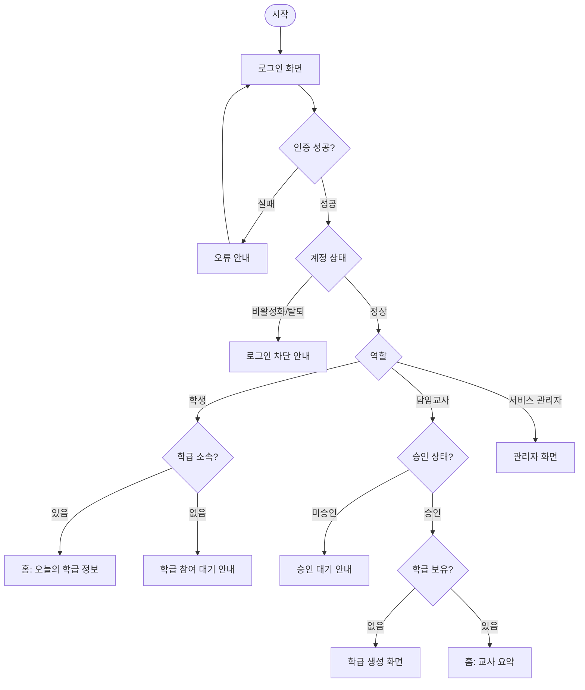

---

## S2. 학생 학급 정보 조회

관련 기능: F-ZTJSNU(대시보드), F-WSHIYO(안내 조회), F-NXPULH(AI 요약·오늘 할 일), F-ZYSPUS(할일 탭)

### S2-1. 오늘의 학급 정보 대시보드 (홈)

1. 학생이 로그인 후 홈에 진입한다.
2. 시스템이 당일·임박 학급 데이터를 조회해 요약 항목을 구성한다: 오늘 시간표, 급식, 청소 당번, 미확인 공지, 예정 과제, 학급 행사.
3. 당일·임박 과제와 행사는 일반 예정 정보와 구분해 표시하고, 미확인 공지와 당일·임박 일정은 우선 표시한다.
4. (예외) 요약 데이터 없음 → 해당 항목 빈 상태 표시.
5. (규칙) 교사 검수 후 공개되지 않은 외부 연동 데이터는 포함하지 않는다.
6. 각 요약 항목 선택 → 원본 상세 화면 이동. 대시보드에서 원본 수정은 불가.
7. 대시보드 조회 이벤트를 기록한다.

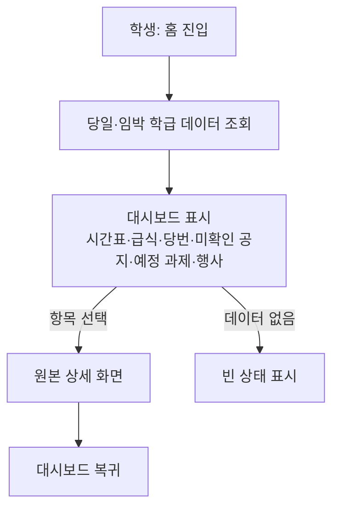

### S2-2. 공지·가정통신문·과제 조회 + AI 요약

1. 학생이 대시보드·우리반 탭·알림에서 안내 항목을 선택한다.
2. 시스템은 공개 시점 이후, 해당 학생이 대상인 안내만 표시한다. (공개일 전·종료 안내 비노출)
3. 안내 상세 화면에서 원문과 외부 자료 URL을 확인한다. (파일 제출·제출 현황 기능 없음)
4. 공지·가정통신문 상세에서는 저장된 원문 기반 AI 요약을 함께 표시한다. (F-NXPULH)
5. (규칙) 근거 데이터가 없으면 AI는 준비물·일정·과제를 임의 생성하지 않는다.

### S2-3. 할일 탭 — 오늘 할 일 확인

1. 학생이 할일 탭에 진입한다.
2. 시스템은 마감 임박 과제 일정, 미확인 공지, 다가오는 행사, AI가 생성한 오늘 할 일을 원본 이동 경로와 함께 표시한다.
3. 항목 선택 → 원본 공지·과제·일정 상세로 이동한다.

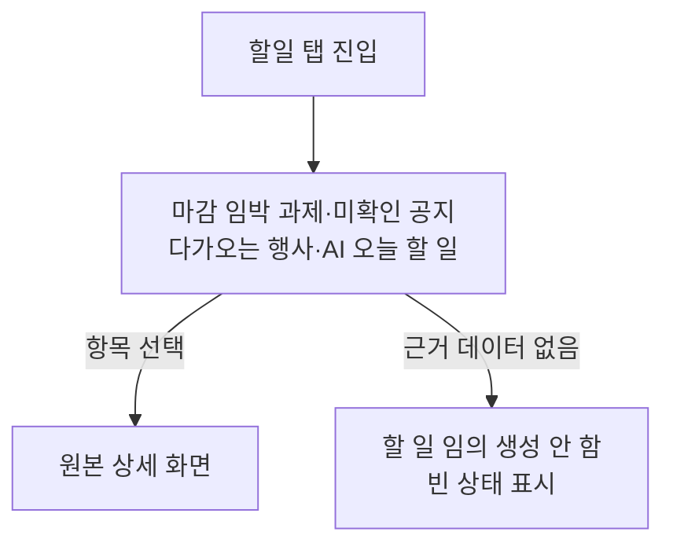

### S2-4. 우리반 탭 — 학급 정보 열람 (학생)

1. 학생이 우리반 탭에 진입한다.
2. 학급 규칙, 시간표, 급식, 청소 당번, 공지·과제·행사 목록을 확인한다.
3. (규칙) 공개된 정보만 표시되며, 시간표·급식은 교사 검수·공개 완료본만 노출된다. 마지막 정상 데이터에는 기준 시각이 표시된다.
4. (권한) 출결 기록 관리·학생 소속 관리 메뉴는 학생에게 표시하지 않는다.

---

## S3. 교사 학급 운영 관리

관련 기능: F-RONORQ(학급 생성·기본 정보), F-FMLMIG(학생 소속), F-WSHIYO(안내 발행), F-WFEXUJ(일정 관리), F-OHHQTM(외부 연동 검수), F-ZOJYKF(출결)

### S3-1. 학급 생성과 기본 정보 설정

1. 승인된 담임교사(연결된 학급 없음)가 학급 생성 화면에 진입한다.
2. 학교명을 검색해 소속 학교를 선택한다. 시스템은 선택한 학교의 시도교육청코드·표준학교코드·학교급을 저장한다.
3. 학급명과 기본 정보(학년, 반)를 입력하고 저장한다.
4. (예외) 필수 학급명 누락 → 저장하지 않고 입력 안내.
5. (예외) 학교 미선택 → 시간표·급식 연동 불가를 안내하고, 수동 입력으로 운영할 수 있게 한다.
6. 생성 후 학급 규칙, 주간 시간표, 청소 당번을 등록·수정한다.
7. 저장된 기본 정보는 학생용 화면과 관련 기능에서 조회된다.
8. (규칙) 담임교사 계정당 학급은 1개만 유지한다.
9. (규칙) 저장된 학교 코드는 시간표·급식 연동(S3-5)의 조회 조건이 된다.

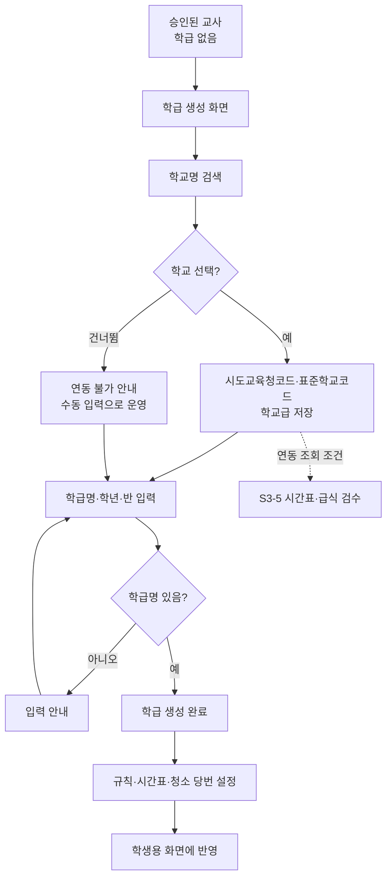

### S3-2. 학생 초대와 소속 관리

1. 담임교사가 우리반 탭 > 학생 관리에서 초대·등록을 요청한다.
2. 시스템이 학생-학급 소속 관계를 생성하고 목록을 갱신한다.
3. (예외) 이미 다른 학급 소속인 학생 → 추가 등록 불허.
4. 소속 해제 요청 시 소속 관계를 해제한다. 해제된 학생은 해당 학급의 신규 정보 접근 권한을 잃는다.
5. (예외) 이미 해제된 관계는 다시 해제하지 않는다.

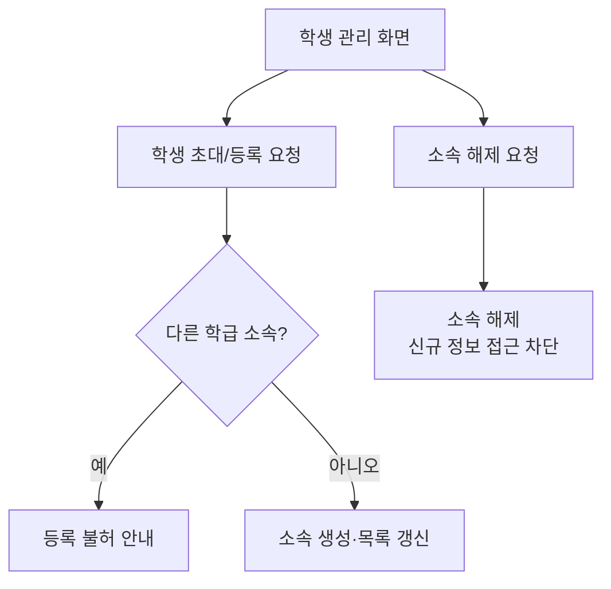

### S3-3. 공지·가정통신문·과제 일정 발행

1. 담임교사가 안내 작성 화면에서 유형(공지/가정통신문/과제 일정)을 선택해 작성한다.
2. 대상, 공개일, 마감일, 외부 자료 URL을 지정한다.
3. (예외) 외부 URL이 유효하지 않으면 저장 전 오류 안내.
4. 저장·공개하면 공개 조건 충족 시 대상 학생에게 조회 가능해진다.
5. 새 공지 공개 시 대상 학생에게 인앱 알림이 생성된다. (→ S4-1)
6. 수정·종료 시 상태를 갱신한다. 공개일 전·종료 안내는 학생에게 비노출.
7. 안내 등록·학생 확인 이벤트를 기록한다.

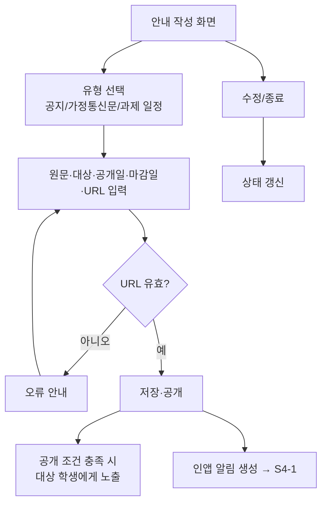

### S3-4. 학급 행사·일정 관리

1. 담임교사가 일정 관리 화면에서 행사·일정을 등록·수정·삭제한다.
2. 학생 공개 여부를 설정한다. 비공개 일정은 학생에게 노출하지 않는다.
3. 공개된 일정은 학생 대시보드·상세 화면에서 조회된다. 삭제된 일정은 더 이상 표시하지 않는다.

### S3-5. 외부 시간표·급식 정보 검수와 공개

1. 시스템이 학급에 저장된 학교 코드로 나이스 API(시간표·급식)에서 정보를 수집해 **검수 대기** 상태로 저장한다. 시간표는 학교급에 따라 중학교·고등학교 엔드포인트를 나누어 호출한다.
2. 담임교사가 검수 화면에서 내용을 확인하고 필요 시 수정한다.
3. 교사가 공개로 전환하면 학생에게 표시된다. (규칙: 검수·공개 전환 없이 자동 공개 금지)
4. (예외) API 연동 실패 → 마지막 정상 데이터를 기준 시각과 함께 표시하고, 교사 수동 입력을 허용한다.
5. 마지막 정상 데이터에는 기준 시각이 기록·표시된다.

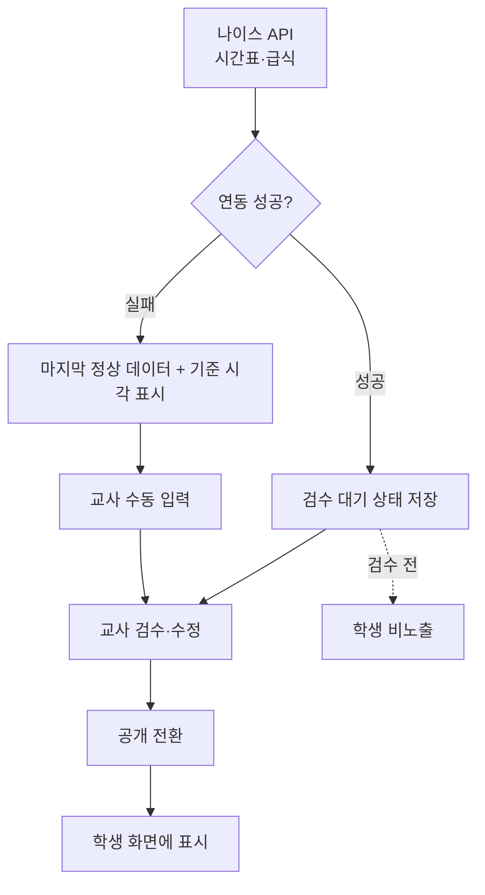

### S3-6. 출결 기록과 변경 이력

1. 담임교사가 출결 화면에서 소속 학생별 출결 상태와 사유를 기록한다.
2. 정정 시 시스템이 변경 전후 값, 수정자, 수정 시각을 이력으로 남긴다.
3. 교사는 현재 출결 기록과 변경 이력을 조회한다.
4. (권한) 다른 학급 학생의 출결은 조회·수정 불가. 학생은 다른 학생의 출결 상태·사유 조회 불가.
5. (규칙) 출결 기능은 학교 공식 행정 시스템을 대체하지 않는다(기록·조회 보조).

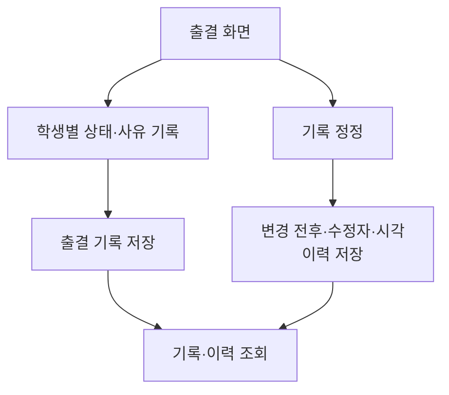

---

## S4. 알림·계정·설정

관련 기능: F-IAXPMY(인앱 알림), F-ETJOMB(계정 종료·보관)

### S4-1. 인앱 알림 확인

1. 새 공지 공개, 임박한 과제 일정, 청소 당번, 학급 행사가 알림 조건을 충족하면 시스템이 대상 학생에게 연결 원본을 가진 인앱 알림을 생성한다.
2. 학생이 더보기 탭 > 알림 목록을 연다. 읽음·읽지 않음이 구분 표시된다.
3. 알림 선택 → 읽음 상태 갱신 → 연결된 공지·과제·일정·당번 정보로 이동.
4. (예외) 연결 원본이 종료·삭제됨 → 접근 불가 상태 안내.
5. (규칙) 푸시·문자·이메일 발송 없음. 학생은 자신에게 생성된 알림만 조회·읽음 처리한다.

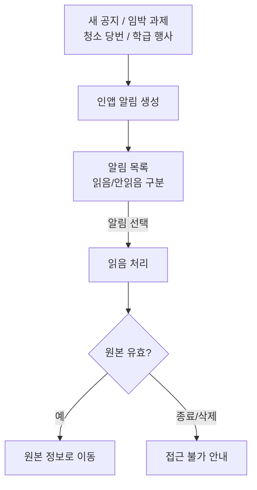

### S4-2. 계정 탈퇴·비활성화와 개인정보 보관

1. 사용자가 더보기 탭 > 계정 관리에서 탈퇴를 요청한다. (또는 서비스 관리자가 비활성화 → S6-2)
2. 시스템이 로그인을 즉시 차단하고, 접근 차단과 식별 정보 삭제 시점을 안내한다.
3. 30일 철회 가능 기간 경과 후 계정 식별 정보를 삭제한다.
   - ⚠ 미결: 30일 내 탈퇴 철회 허용 여부 (권장: 철회 허용)
4. 보관 기간 만료 데이터는 식별 정보를 삭제 또는 익명 처리하고 처리 이력을 남긴다.
   - 출결 사유: 학급 종료/학생 탈퇴 후 해당 학년도 종료일로부터 1년 제한 보관.
   - AI 질문·오류 신고·알림 기록: 생성일로부터 90일 보관.
   - 삭제·익명 처리 이력: 1년간 감사 목적 보관.
5. (권한) 보관 중 데이터는 권한 있는 담임교사와 서비스 관리자만 접근한다.

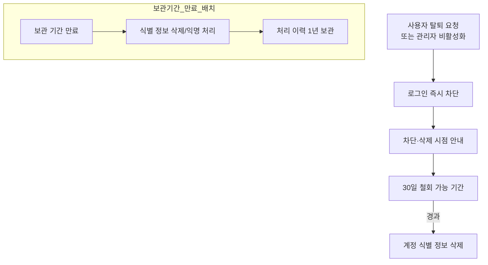

---

## S5. AI 챗봇

관련 기능: F-CCZIQT(학급 데이터 기반 AI 질의응답)

### S5-1. 학급 데이터 기반 질의응답

1. 학생이 챗봇 화면에서 자연어 질문을 전송한다. (예: "오늘 과제는 뭐야?", "내일 청소 당번은 누구야?", "이번 주 행사와 준비물 알려줘")
2. 시스템이 학생의 소속과 접근 권한을 확인하고, 허용된 학급 데이터만 검색한다.
3. 검색 근거로 AI 답변을 생성한다. (Upstage Solar API)
4. 답변에 참조 데이터의 출처와 최종 갱신 시각을 함께 표시한다.
5. (예외) 근거 데이터 없음 또는 권한 밖 질문 → 추정하지 않고 답변 가능 범위 또는 확인 필요 안내.
6. (규칙) AI는 학급 데이터 밖의 정보를 근거로 임의 답변하지 않는다.
7. 질문·답변 이벤트를 기록한다. (AI 질의 기록: 질문, 답변, 참조 출처, 생성 시각 — 90일 보관)

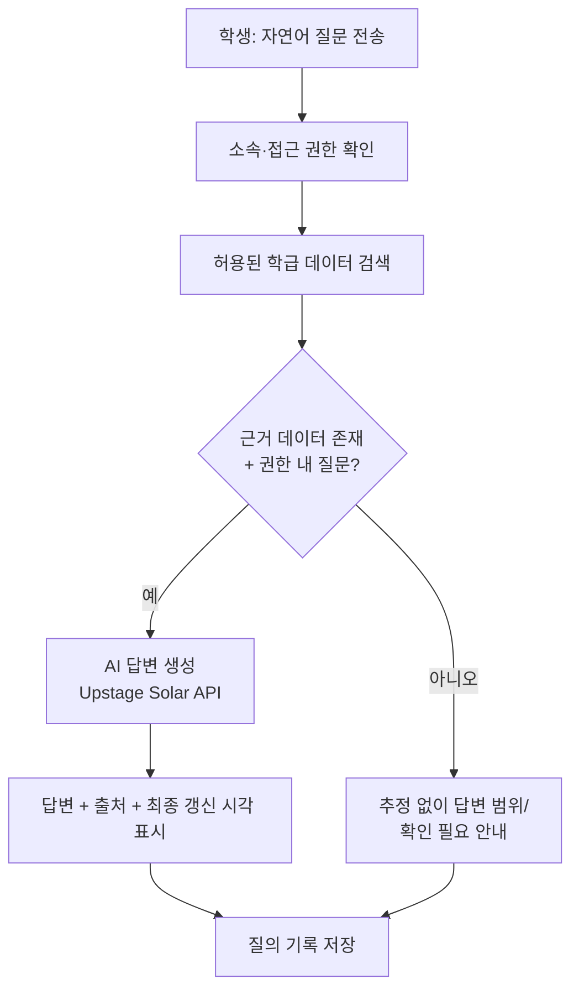

---

## S6. 서비스 관리자

관련 기능: F-UBHBGS(담임교사 승인), F-ETJOMB(계정 비활성화)

### S6-1. 담임교사 승인

1. 서비스 관리자가 관리자 화면에서 담임교사 가입 목록을 확인한다.
2. 담임교사 계정의 승인 상태를 변경한다.
3. 승인된 담임교사만 학급 생성·운영이 가능해진다. (→ S3-1)
4. 미승인 담임교사는 로그인 시 승인 대기 안내를 본다. (→ S1-1)

### S6-2. 계정 비활성화

1. 서비스 관리자가 특정 계정을 비활성화한다.
2. 해당 계정의 로그인이 즉시 차단된다.
3. 이후 처리(철회 기간·식별 정보 삭제·보관 정책)는 S4-2 흐름을 따른다.

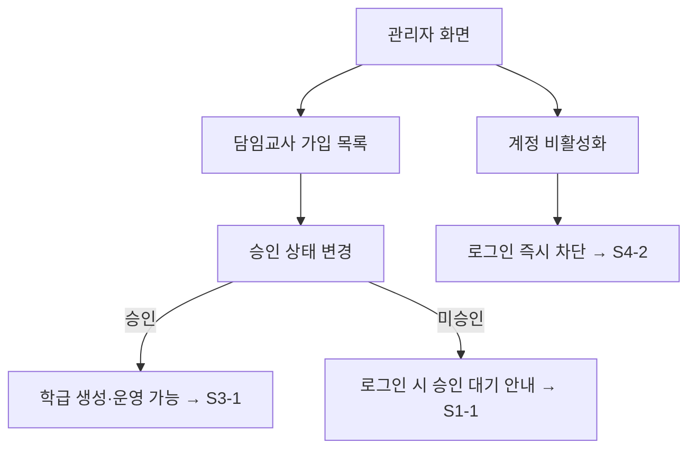

---

## 참고: 원본 다이어그램과의 관계

- Manyfast 유저플로우 v1의 섹션 구성(인증·진입 12노드 / 학생 학급 정보 조회 34노드 / 교사 학급 운영 관리 54노드 / 알림·계정·설정 18노드 / AI 챗봇 6노드 / 서비스 관리자 5노드)을 그대로 따른다.
- 노드 단위 원본(129노드·187엣지)은 본 문서에 1:1로 옮기지 않았으며, 각 섹션의 흐름은 기능명세서의 트리거·동작·예외·규칙 정의로부터 재구성했다. 화면 단위 세부 분기는 Manyfast의 원본 다이어그램을 우선 기준으로 삼는다.

---

## 변경 이력

### 2026-08-29 · 외부 연동 API 정정 및 학교 선택 단계 추가

> 실제 API를 호출해 확인한 결과를 반영했다. 원문에서 달라진 부분은 아래와 같다.

| # | 대상 | 변경 내용 | 근거 |
|---|---|---|---|
| 1 | S3-1 단계 | 학교명 검색·선택 단계를 2번으로 삽입. 이후 단계 번호가 하나씩 밀림 | 시간표·급식 조회에 시도교육청코드·표준학교코드가 필수 |
| 2 | S3-1 단계 | 학교 미선택 시 연동 불가 안내 + 수동 입력 경로를 예외로 추가 | 학교를 못 찾아도 학급 운영은 계속되어야 함 |
| 3 | S3-1 다이어그램 | `학교명 검색 → 학교 선택? → 코드 저장` 분기 추가. 저장된 코드가 S3-5 의 조회 조건임을 점선으로 연결 | 두 플로우의 의존 관계를 드러내기 위함 |
| 4 | S3-5 단계·다이어그램 | "나이스 API(시간표)·급식 공공데이터 API(급식)" → "나이스 API(시간표·급식)". 학교급별 엔드포인트 분기 명시 | 급식도 나이스에서 제공. 중·고 시간표 엔드포인트가 분리되어 있음 |

**함께 수정한 문서**: `반창고_기획서.md`(1.2, 3.2, 4, 7.2), `반창고_기능명세서.md`(R-CZXHBJ, F-RONORQ, F-OHHQTM)
